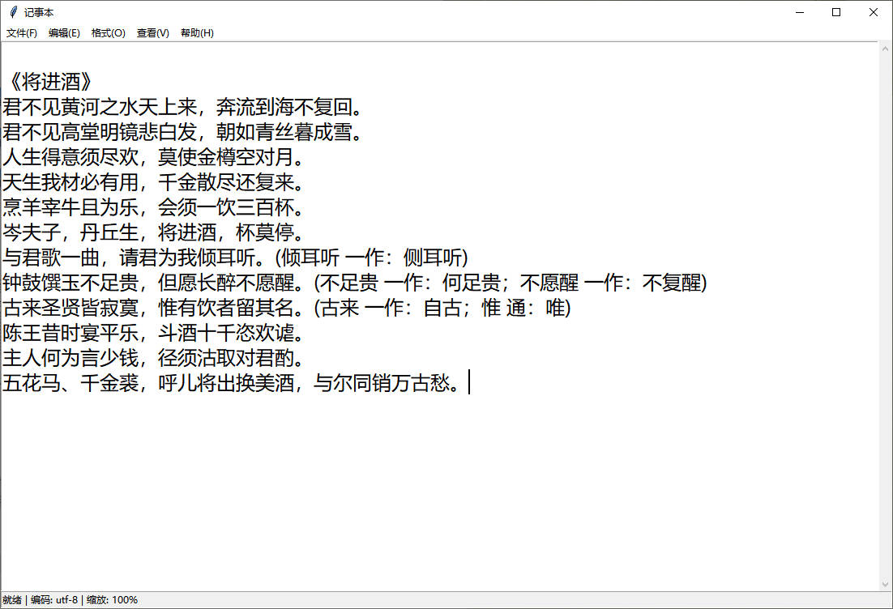

## NotepadX

这是一个模仿 Windows 操作系统中自带的记事本程序的 Python 应用。它基于Tkinter编写，提供了基本的文本编辑功能。

## 功能

- 打开和创建文本文件
- 保存和另存为文本文件
- 基本的文本编辑功能，如复制、粘贴、剪切和撤销
- 字体大小简单设置
- 支持文本换行和不换行显示
- 快捷键操作

## 依赖

- Python 3.8+
- Tkinter（Python 的标准 GUI 库，随 Python 自动安装）

## 快速开始

确保您的系统中已安装 Python 3.8 或更高版本。

1. 克隆本项目或下载并解压到本地目录

```
git clone https://github.com/ihmily/NotepadX.git
```

​	2.进入项目目录

```bash
cd NotepadX
```

​	3.运行程序

```bash
python notepad.py
```

通过点击界面右上角的菜单按钮或使用快捷键来访问所有功能。

## 截图



## 许可证

本项目遵循 [MIT License](LICENSE)。

